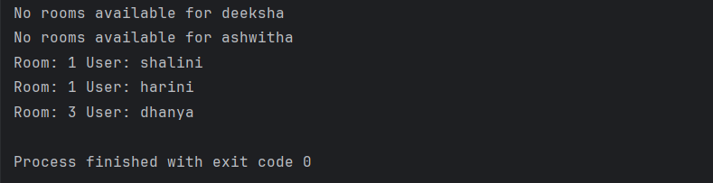
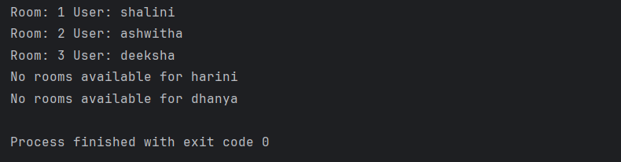

#  Multi-threaded Hotel Booking System (Java)

A console-based simulation of hotel room bookings built using core Java.  
This project demonstrates **multithreading**, **thread safety**, and **OOP principles** in a backend-like system.

---

##  Features

-  Simulates multiple users booking rooms at the same time using threads
-  Ensures **thread-safe** room booking using `synchronized`
-  Demonstrates race condition handling using simulated delays (`Thread.sleep`)
-  Clean object-oriented design with separation of concerns

---

##  Classes Used

- `Hotel`: Manages rooms, booking logic, shared state
- `Room`: Represents a single room with booking status
- `User`: Contains user info and assigned room
- `BookingSystem`: Coordinates booking flow (service layer)
- `BookingTask`: Implements `Runnable` for multithreading
- `Main`: Runs the simulation

---

##  Technologies

- Java (`Thread`, `Runnable`, `synchronized`, etc.)
- Console-based interaction
- No external libraries

---

##  Comparison: With vs. Without Synchronization

###  Without Synchronization (Race Condition)

Notice how multiple users may get the same room due to race condition.

---

###  With Synchronization

Only one user gets each room — thread-safe behavior.

